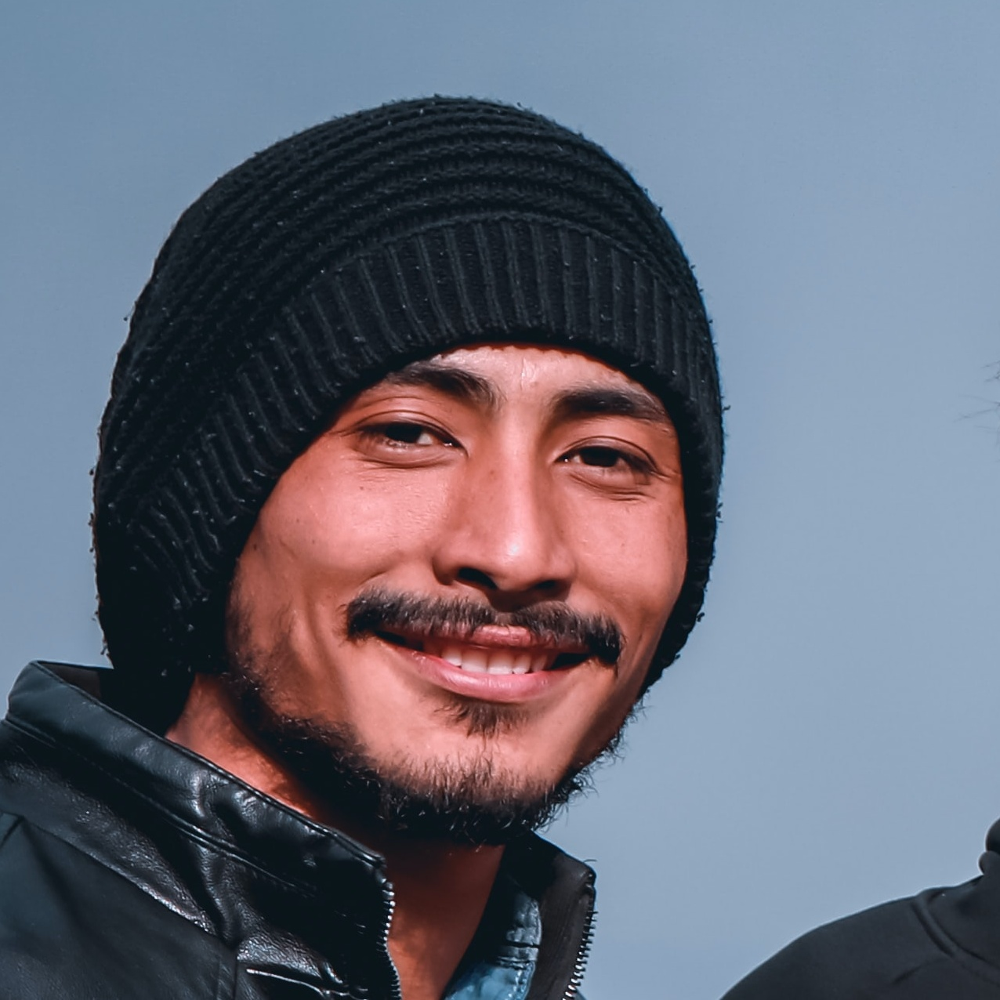

# FaceCrop

Automatically crop faces out of pictures.
**My usecase:** for automatically crop employee-photos to a square for automated IT processing.

### ToDo's:
- [x] Add function for only process first found face in picture
- [ ] Find & Test other OpenCV cascades for face recognition to reduce false detections.

## Installation:
_Tested with Python **3.9.7**_
```
pip3 install -r requirements.txt
```

## HowToUse:
1. Insert your **source** pictures in the **input** folder
2. Run the Python script (See command below)
3. Check the results in the **output** folder
4. Nothing else...
##### Process only first face find in a picture
When you know that there is only one person on the source picture.
You should use this mode - otherwise false/positives will also be saved.
```
python3 facecrop.py --takefirst
```
##### Process all faces find in picture
Running this mode on single person pictures results sometimes in additional false/positive cropped pictures.
```
python3 facecrop.py
```

## Example 01:
Photo by <a href="https://unsplash.com/@brokenlenscap?utm_source=unsplash&utm_medium=referral&utm_content=creditCopyText">Ben Parker</a> on <a href="https://unsplash.com/s/photos/people?utm_source=unsplash&utm_medium=referral&utm_content=creditCopyText">Unsplash</a>
#### Input:

#### Output:


## Example 02:
Photo by <a href="https://unsplash.com/@rafaelladiniz?utm_source=unsplash&utm_medium=referral&utm_content=creditCopyText">Rafaella Mendes Diniz</a> on <a href="https://unsplash.com/s/photos/people?utm_source=unsplash&utm_medium=referral&utm_content=creditCopyText">Unsplash</a>
#### Input:

#### Output:


## Example 03:
Photo by <a href="https://unsplash.com/@ankit_raj19?utm_source=unsplash&utm_medium=referral&utm_content=creditCopyText">Ankit Rajbhandari</a> on <a href="https://unsplash.com/s/photos/group-photo?utm_source=unsplash&utm_medium=referral&utm_content=creditCopyText">Unsplash</a>
#### Input:

#### Output:





